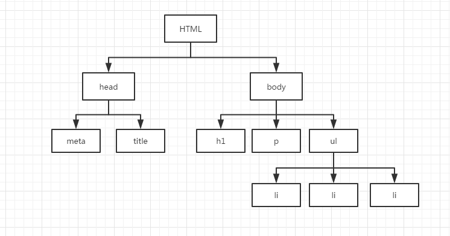

# JS 常见面试题


## 目录

- [HTML](../html/html.md)

- [CSS](../css/css.md)

- [JavaScript](../js/js.md)

- [笔试题](../code/code.md)

- [TypeScript](../typescript/typescript.md)

- [Vue](../vue/vue.md)

- [Webpack 和前端工程化](../webpack/webpack.md)

- [微信小程序](../mini-program/mini-program.md)


## DOM

**文档对象模型**（Document Object Model）是一个应用编程接口，网页可以抽象为一颗 DOM 树，开发者可以通过 DOM 树控制网页的内容和结构。




## JS 基本数据类型和引用数据类型

- 基本数据类型：Boolean、Number、String、Undefined、Null、Symbol、BigInt
- 引用数据类型：Object（Function、Date、RegExp、Array、Map、Set...）


## undefined 和 null 区别

- undefined：变量未声明；变量声明但未初始化
- null：空对象指针；建议使用 null 初始化将来要保存对象的变量


## var、let  和 const 声明

1. `var` 声明的是函数作用域，`let` 声明的是块级作用域。

2. `var` 声明的变量会自动提升到函数作用域顶部，例如可以先使用后声明；而 `let` 声明的变量不会在作用域中被提升，即需要先声明再使用。
3. `const` 与 `let` 行为基本一致，只不过 `const` 声明的是常量，不允许被修改；如果 `const` 声明的变量是一个对象的引用，则对象内部可以被修改，只不过变量的引用不能修改。 


## 位操作符

| 符号  | 名称       | 操作                               |
| ----- | ---------- | ---------------------------------- |
| `&`   | 与         | 两位都是1时返回1，否则为0          |
| `|`   | 或         | 有一位是1时返回1，两位都是0时返回0 |
| `~`   | 非         | 取反操作，最终数值取反减1          |
| `^`   | 异或       | 相同为0，不同为1                   |
| `<<`  | 左移       | 所有数值左移，低位补0，保留符号位  |
| `>>`  | 有符号右移 | 所有数值右移，高位用符号位补充     |
| `>>>` | 无符号右移 | 所有数位右移，高位补0              |


## == 操作符的判断及强制类型转换规则

若两个操作数类型相同，则比较值是否相等；若两者类型不同，则会进行**强制类型转换**：

1. 如果两者分别是 `null` 和 `undefined`，则返回 `true`；
2. 如果其中一个操作数是 `boolean` 类型，则转化为 `number`（`true` 转化为 `1`，`false` 转化为 `0`）；
3. 如果其中一个操作数是 `string` 类型，另一个是 `number` 类型，则会调用 `Number()` 方法将 `string` 转化为 `number`（如果包含非数字字符，则转化为 `NaN`，如果为空字符串，则转化为 `0`）；
4. 如果其中一个操作数是 `object`，另一个是基本数据类型，则调用对象的 `valueOf()` 转化为基本数据类型；
5. 如果两个操作数都是 `object`，则比较引用的是否为同一个对象；
6. 如果任意一个操作符是 `NaN`，则返回 `false`（`NaN` 和 `NaN` 不相等）。


## == 和 ===

`==` （不全等）不保证两个操作数的类型和值都相等，只表示类型转换后的值相等。

`===` （全等）表示两个操作数的类型和值都相等。


## 如何令 a == 1 && a == 2 && a == 3 成立

- 重写对象的 `valueOf()` 方法：使用 `==` 比较时，如果一个操作数是对象，另一个操作数是基本类型，就会调用对象的 `valueOf()` 方法。

```js
const a = {
  i: 1,
  valueOf() {
    return this.i++;
  },
};
```

- 使用 `Object.defineProperty()` 在当前上下文定义 `a` 属性，并修改 `get()` 函数：

```js
let _a = 1;
Object.defineProperty(this, 'a', {
  get() {
    return _a++;
  },
});
```


## 箭头函数和普通函数

箭头函数相比于普通函数，有以下特点：

1. 不能作为构造函数
2. 不能使用 `arguments` 对象，需要使用剩余参数代替
3. 普通函数 `this` 指向调用函数的上下文（谁调用了函数，`this` 就指向谁），是可变的；箭头函数的 `this` 指向函数定义时的上下文，是固定的


## this 的指向

- 普通函数的 `this` 指向调用函数的上下文对象，也就是谁调用这个函数， `this` 就指向谁，如果直接调用，则指向全局对象，这个值只有在函数执行时才能确定。
- 通过 `new` 实例化对象，构造函数的 `this` 指向实例。
- 可以通过函数的 `apply()`、`call()` 和 `bind()` 方法改变函数 `this` 的指向。


## forEach() 方法可以退出循环吗？

除抛出异常之外，没有其他方法可以停止或中断循环（`continue/break` 无效，`return` 等同于 `break`）。当你需要通过抛出异常来退出循环时，说明该场景不适合使用 `forEach()` 。


## 闭包

闭包指的是**引用了另一个函数作用域中变量的函数**，通常是在嵌套函数中，当内部函数引用了外部函数的变量，即使外部函数执行完，作用域链被销毁，内部函数还是保留其活动对象，这些变量仍然保留在内存中，这就造成了内存泄漏，采用引用计数垃圾回收机制的旧浏览器就无法进行垃圾回收。


## 闭包的作用

1. 创建私有变量
2. 使函数中的变量继续保存在内存中


## 执行上下文

当执行一个函数时，我们称进入了一个执行上下文（或者叫执行环境），JS 通过执行上下文栈来管理上下文，可以分为三个阶段：

1. **创建阶段**：当调用函数时，会为该函数创建一个执行上下文并压入栈中。JS 一开始在全局环境执行时会创建全局上下文并压入栈中。
2. **执行阶段**：JS 会先执行上下文栈顶的函数。
3. **回收阶段**：当函数执行完后，会从上下文栈中弹出并执行下一个函数，该函数作用域中创建的变量也会等待垃圾回收。当所有代码执行完后，全局上下文也会弹出。


## 变量对象和作用域链

- **变量对象**：每个执行上下文都会有一个变量对象，用于保存当前上下文定义的变量和函数（一开始会添加通过函数声明定义的函数以及通过 `var` 声明的变量 ）。
- **作用域链**：当执行上下文代码时，JS 会创建一个作用域链，用于决定上下文访问变量和函数的顺序。当前上下文的变量对象始终处于作用域链的最顶端，同时作用域链还会包含上一个上下文的变量对象，以此类推，直至全局上下文。当解析变量时，会通过变量的标识符从作用域链中进行查找，首先会从当前上下文的变量对象中查找，如果没有找到，会沿着作用域链往上一级上下文的变量对象里边查找，以此类推。由此可以看出，内部上下文可以通过作用域链访问外部上下文的变量，反之则不行；除此之外，内部上下文可以替换外部上下文中的同名变量。


## 函数防抖和函数节流

函数防抖（debounce）和函数节流（throttle）通过控制函数一定时间内的执行次数，来避免某些函数频繁执行带来的性能损耗，常用于限制事件监听，如输入框联想，滚动监听等。

- 防抖：函数必须间隔特定时间才能执行，如果期间重复触发，就会重新计时
- 节流：一定时间内，只会执行一次函数

```js
// 防抖
function debounce(func, wait = 0) {
  let timer = null;
  return function () {
    if (!timer) {
      timer = setTimeout(function () {
        func.apply(this, arguments);
        timer = null;
      }, wait);
    }
  };
}

// 节流
function throttle(func, wait = 0) {
  let timer = null;
  return function () {
    if (!timer) {
      func.apply(this, arguments);
      timer = setTimeout(() => {
        timer = null;
      }, wait);
    }
  };
}
```


## 栈内存和堆内存

- **栈内存空间**：用栈作为数据结构在内存中所申请的空间。基本数据类型变量存储在栈内存中，因为基本数据类型占用空间小、大小固定，通过值来访问，属于被频繁使用的数据。
- **堆内存空间**：用堆作为数据结构在内存中所申请的空间。引用数据类型存储在堆内存中，引用数据类型占据空间大、大小不固定，如果存储在栈中，将影响程序的运行性能。引用数据类型会在栈中存储一个指针，这个指针指向堆内存空间中该实体的起始地址。


## JS 垃圾回收机制

JavaScript 垃圾回收程序每隔一个周期，就会判断哪些变量不再使用，然后释放它占用的内存。JS 垃圾回收机制一般分为两种：

- **标记清理**（mark-and-sweep）（常用）：当变量进入上下文，比如在函数内部声明一个变量时，这个变量就会被标记为存在上下文中；当变量离开上下文，例如函数执行完，该变量就会被标记为离开上下文，这样，下一次垃圾回收程序清理内存时，就会释放该变量的内存。
- **引用计数**（reference counting）（旧版本浏览器）：当一个值被一个变量引用时，该值的引用数加 1，当引用该值的变量被其他值覆盖时，该值的引用数减 1，当引用数为 0 时，说明该值不需要被用得到，则内存可以被回收。这种回收机制有个弊端，当两个对象通过属性值**循环引用**时，它们的引用数都是 2，即使函数执行完，这两个对象不在作用域中时，这两个变量也不会被垃圾回收程序释放。


## 哪些情况会导致内存泄漏

- **意外的全局变量：** 由于使用未声明的变量，而意外的创建了一个全局变量，而使这个变量一直留在内存中无法被回收。

- **被遗忘的计时器或回调函数：** 设置了 setInterval 定时器，而忘记取消它，如果循环函数有对外部变量的引用的话，那么这个变量会被一直留在内存中，而无法被回收。

- **脱离 DOM 的引用：** 获取一个 DOM 元素的引用，而后面这个元素被删除，由于一直保留了对这个元素的引用，所以它也无法被回收。

- **闭包：** 不合理的使用闭包，从而导致某些变量一直被留在内存当中。


## 深拷贝和浅拷贝

- **浅拷贝**：只复制引用地址，新旧对象共享相同的内存空间，修改新对象属性会影响原对象，常见的浅拷贝方法：扩展运算符、`Object.assign`、`Object.create`、`Array.protorype.slice` 和 `Array.prototype.concat`
- **深拷贝**：创建一个于原对象一模一样的新对象，新旧对象不共享内存空间，修改新对象属性不会影响原对象，常见的深拷贝方法：`lodash.cloneDeep`、`JSON.stringify` 以及手写递归方法

其中，使用 `JSON.stringify` 进行深拷贝的弊端：

1. 不支持 undefined、symbol 和函数类型
2. Date 类型会转化为字符串
3. 只能序列化可枚举的属性


## Map 和 WeakMap 区别

- Map 的 key 可以是任意数据类型，WeakMap 的 key 必须是对象。
- Map 的 key 如果是对象，就相当于这个对象被引用，就不会被当做垃圾回收；WeakMap 的 key 不属于正式引用，不会阻止垃圾回收，也就是说，如果 key 没有其他引用，就会执行垃圾回收。
- 因为 WeakMap 中的 key/value 任何时候都有可能被销毁，所以 WeakMap 本身不可迭代。 


## JS 设计模式

### 工厂模式

工厂模式用于创建多个类似的对象，但是创建的对象不属于同一个类型（除了 `Object`）

```js
function createPerson(name, age) {
  let obj = new Object();
  obj.name = name;
  obj.age = age;
  obj.sayName = function () {
    console.log(this.name);
  };
  return obj;
}

const person = createPerson('Tom', 18);
person.sayName(); // Tom
```


### 构造函数模式

构造函数模式解决了创建特定类型对象的问题，但是构造函数定义的方法，在每个实例上都会被创建一遍。

```js
function Person(name, age) {
  this.name = name;
  this.age = age;
  this.sayName = function () {
    console.log(this.name);
  };
}

const person = new Person('Tom', 18);
person.sayName(); // Tom
console.log(person instanceof Person); // true
```


### 原型模式

通过原型模式创建的属性和方法，所有实例都可以通过原型链查找访问到，也就是说是共享的。原型模式不能在创建实例时传递参数，除此之外，由于原型对象共享属性和方法，修改引用类型的原型属性时，会出现数据污染的问题。

```js
function Person() {}

Person.prototype.name = 'Tom';
Person.prototype.age = 18;
Person.prototype.sayName = function () {
  console.log(this.name);
};

const person = new Person();
person.sayName(); // Tom
console.log(Object.getPrototypeOf(person) === Person.prototype); // true
```


### 组合模式

组合模式通过构造函数模式定义实例属性，通过原型模式定义共享属性和方法，既可以通过构造函数传参，又可以通过原型共享节省内容。

```js
function Person(name, age) {
  this.name = name;
  this.age = age;
}

Person.prototype.sayName = function () {
  console.log(this.name);
};

const person = new Person('Tom', 18);
person.sayName(); // Tom
console.log(person instanceof Person); // true
console.log(Object.getPrototypeOf(person) === Person.prototype); // true
```


### 类

ES6 引入 `class` ，本质上是组合模式的语法糖。

```js
class Person {
  constructor(name, age) {
    this.name = name;
    this.age = age;
  }

  sayName() {
    console.log(this.name);
  }
}

const person = new Person('Tom', 18);
person.sayName(); // Tom
console.log(person instanceof Person); // true
```


## 通过 new 创建实例的过程

1. 在内存中创建新对象。
2. 新对象的原型指针指向构造函数的原型。
3. 构造函数内的 `this` 指向新对象。
4. 执行构造函数内部代码。
5. 如果构造函数返回非空对象，则返回该对象，否则返回刚创建的新对象。


## 原型链的终点

`Object` 是其他对象的基类，所以所有对象的原型链最终都会指向 `Object` ，而 `Object` 的原型对象是 `null`。


## 如何判断一个对象是某个类的实例

1. `instanceof`（判断构造函数的原型对象是否在实例的原型链上）
2. 判断对象的 `constructor` 属性是否为类的构造函数（不安全，因为 `constructor` 可能被修改）
3. 判断对象的原型指针是否指向类的原型

```js
console.log(person instanceof Person);
console.log(person.constructor === Person);
console.log(Object.getPrototypeOf(person) === Person.prototype);
```


##  遍历对象属性的方法

- `for-in`：遍历实例及其原型对象的所有可枚举属性。
- `Object.keys()`：只返回实例本身的可枚举属性。
- `Object.getOwnPropertyNames()`：返回实例及其原型对象的所有属性，包含不可枚举的（例如 `constructor`）。


## Proxy

代理（Proxy）是 ES6 新增的特性，可以对对象的读写等操作进行拦截：

```js
const target = {
  name: 'target',
};

const handler = {
  get(target, key) {
    console.log(`属性${key}被读取，值为：${target[key]}`);
    return target[key];
  },
  set(target, key, value) {
    console.log(`属性${key}被设置，旧值为：${target[key]}，新值为：${value}`);
    target[key] = value;
    return value;
  },
};

const proxy = new Proxy(target, handler);

console.log(proxy.name);
proxy.name = 'target2';
console.log(proxy.name);
```

Proxy 的应用场景：隐藏属性、数据验证、函数参数验证、数据绑定（Vue）。


## Promise、async/await

- `Promise` 是 ES6 增加的一种异步编程机制，可以解决“回调地狱”的问题。

- `async/await` 是 ES2017 推出的 `Promise` 的语法糖，可以使用更加接近同步编程的方式处理异步代码。使用 `async` 声明的函数叫做异步函数，异步函数的返回值会被 `Promise.resolve` 包装成一个 `Promise` 对象。`await` 需要在异步函数中使用，`await` 可以暂停异步函数代码的执行，等待异步代码执行完，再执行其他代码。


## Promise.all、Promise.race、Promise.any

- `Promise.all()`：所有 `Promise` 都解决则返回一个解决值得数组，如果有 `Promise` 拒绝，则会返回第一个拒绝的状态值。
- `Promise.race()`：会返回第一个解决或者拒绝的 `Promise`，这个方法也称为竞速方法。
- `Promise.any()`：会返回第一个解决的 `Promise` 的结果，如果全部拒绝则返回失败结果。


## JS 单线程

- **进程**：资源分配的最小单位
- **线程**：CPU 调度的最小单位

进程是火车，线程是车厢，线程在进程下运行，一个线程无法独立运行，一个进程可以包含多个线程（一辆火车可以有多个车厢）。进程要比线程消耗更多的计算机资源（加列火车比加节车厢更耗资源）。

- JS 是单线程语言，执行完一个任务之后才能执行其他任务。
- 浏览器内核是多线程。一些 I/O 操作、定时器和事件监听都是由浏览器提供的其它线程来完成的。


## JS 事件循环和任务队列

JS 是单线程语言，事件循环是 JS 的执行机制，可以处理同步任务和异步任务。

在一次事件循环中，遇到同步任务，立即执行，遇到异步任务，将其放到任务队列中，同步代码执行完之后，检查当前任务队列中是否有异步任务，如果有，则执行异步任务；如果没有，则继续执行同步任务。


## 宏任务和微任务

**宏任务**：script、计时器、网络请求、事件、文件读写

**微任务**：Promise

异步任务可分为宏任务和微任务，这两者主要是执行顺序不同，每次执行完宏任务之后，先执行微任务队列里边的微任务，然后再执行下一个宏任务。

一道经典面试题，写出以下代码的输出顺序：

```js
console.log(1);

setTimeout(() => {
  console.log(2);
}, 0);

new Promise((resolve, reject) => {
  console.log(3);
  resolve();
  console.log(4);
}).then(() => {
  console.log(5);
});

console.log(6);

// 1 3 4 6 5 2
```

首先，打印 1 是同步代码，直接执行；

然后定时器是宏任务，放到宏任务队列中；

然后 `Promise` 构造函数本身是同步代码，因此按顺序打印 3 和 4；

然后 `Promise` 的 `then` 毁掉函数是微任务，放到微任务队列中；

打印 6 是同步代码直接执行；

当前宏任务执行完毕（script 本身就是一个宏任务），执行所有微任务，打印 5；

执行下一个宏任务，打印 2。


## GET 请求和 POST 请求

|          | GET 请求                                    | POST 请求                                        |
| -------- | ------------------------------------------- | ------------------------------------------------ |
| 发送方式 | 通过 URL 发送，参数通过 & 连接              | 发送请求体                                       |
| 数据类型 | 只支持 ASCII 字符                           | 二进制数据                                       |
| 语义     | 用于请求数据                                | 用于提交数据                                     |
| 缓存     | 能被浏览器缓存，再次访问返回304             | 不能被浏览器缓存                                 |
| 数据长度 | 浏览器对 URL 长度有限制，一般是 2048 个字符 | 无限制                                           |
| 数据包   | 一次发送                                    | 浏览器一般分两次发送，先发送请求头，再发送请求体 |
| 安全     | 敏感数据放在 URL 请求参数中会暴露           |                                                  |


## 如何解决跨域问题

1. JSONP

JSONP（JSON with padding）是通过动态创建`<script>` 元素并为 `src` 属性指定跨域 URL 实现的。JSONP 可以从不同域拉去可执行代码，但不能防止域的恶意代码，而且不能确定 JSONP 请求是否失败。

2. CORS

CORS（Cross-Origin Resource Sharing）跨域资源请求，通过使用自定义 HTTP 头部来实现浏览器与服务器的跨域通讯，服务器端通过 `Access-Control-Allow-Origin` 匹配浏览器请求。

3. proxy

受浏览器同源策略的影响，浏览器不能跨域访问接口，而服务器不受此策略的影响，所以可以通过本地服务器代理请求，然后访问不同源的接口。


## cookie 和 Storage

|           | cookie                           | Storage                                                      |
| --------- | -------------------------------- | ------------------------------------------------------------ |
| http 请求 | 发送请求时请求头会包含 cookie    | Storage 只存储在客户端                                       |
| 大小      | 一般4KB                          | 一般5MB                                                      |
| 有效期    | 可以设置过期时间，默认浏览器关闭 | `localStorage` 长期保存，`sessionStorage` 持续到网页会话被关闭 |


## JS 模块化的发展

1. 引入多个 script 文件，需要手动管理文件加载顺序，而且无法避免变量污染的问题
2. 通过立即执行函数对代码进行封装
3. Node 使用 CommonJS 规范来封装模块
4. ES6 原生支持模块的导入导出


## ES6 新特性（总）

1. 新增块级作用域及 `let` 和 `const` 声明
2. 解构赋值
3. 扩展运算符
4. 箭头函数
5. 新增数据结构：`Map`、`Set`、`WeakMap` 和 `WeakSet`
6. 新增数据类型 `symbol`
7. `Promise`
8. `Proxy` 和 `Reflect`
9. 类
10. 模块化